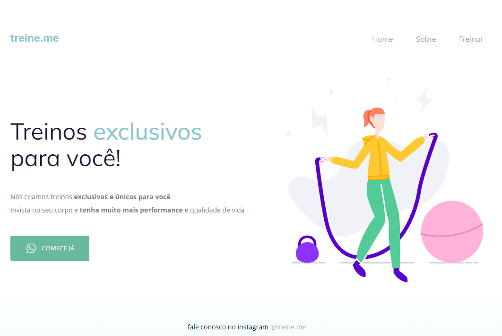

# Treine-me - Página Web

> Criação um layout correspondente a uma página treine-me, usando o HTML e CSS. Projeto do Nível 2 do curso Explorer da Rocketseat

## Visão Geral
Projeto do Nível 2 do curso Explorer da Rocketseat para replicar o layout de uma página especificado no Figma. Foi criado um layout correspondente a uma página Treinos Exclusivos, usando o HTML e CSS; Avançando nas ferramentas HTML e CSS através do trabalho com textos, posicionamentos, espaçamentos e introdução a novas propriedades, como:
   1. Conceito Box Model;
   2. Ferramenta de desenvolvimento DevTools;
   3. Conceito de Flexbox do CSS;
   4. Melhorias na Acessibilidade e Refatoração;
   5. Semântica e acessibilidade.

## Demonstração
Publicado na github-pages, pode ser acessado clicando [aqui](https://susileal.github.io/treine-me/)

## Como Executar

1. Clone este repositório: `git clone [https://github.com/susileal/treine-me.git]`
2. Abrir o arquivo index.html em um browser de sua preferência

## Tecnologias Utilizadas
- HTML
- CSS3
